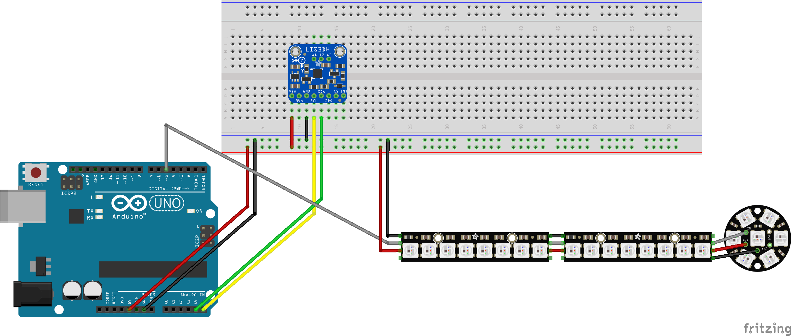
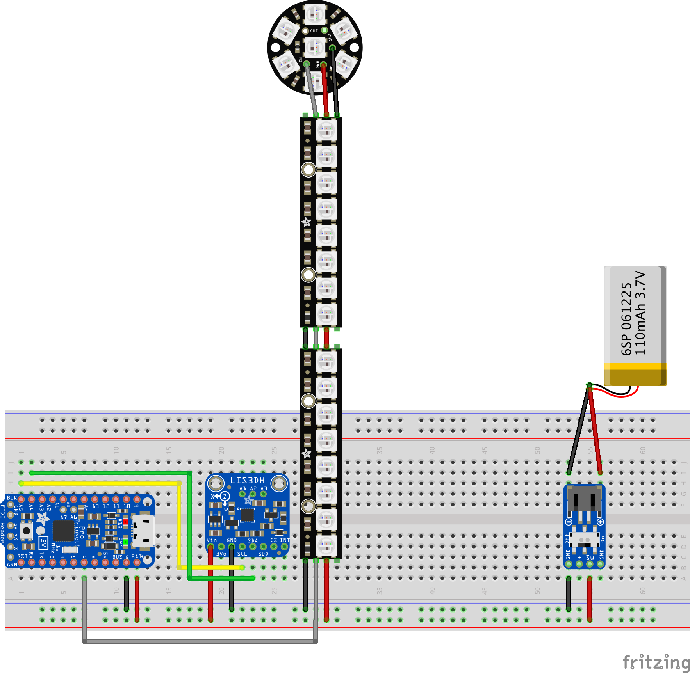
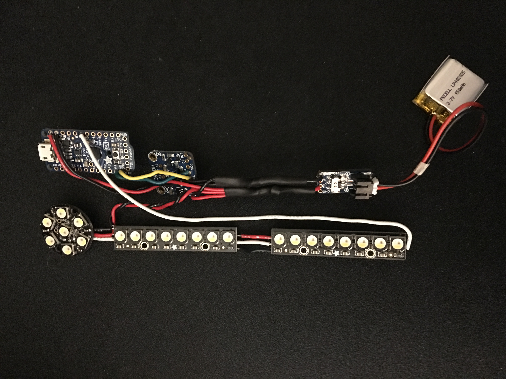

# Pinewood Derby 2017 Car
Resources for our Pinewood Derby 2017 car, featuring an Adafruit Trinket Pro and accelerometer to control an light sequence on Neopixel LED strips.

## Video

## Circuits

### Arduino Uno Prototype

Fritzing file: **Derby Car - Arduino Uno.fzz**

We used an Arduino Uno to prototype the circuit. The Uno is breadboard-friendly and easy to work with. We moved to the Adafruit Trinket Pro once we finalized the circuit design and behavior.

### Adafruit Trinket Pro

Fritzing file: **Derby Car - Trinket.fzz**

We used the Adafruit Trinket Pro to power the final design. It's significantly smaller in size compared to the full-blown Arduino and features all of the pins we'd need to access the accelerometer and control the LEDs. The smaller, but less powerful, Adafruit Trinket did not have sufficient memory to hold our program with libraries we needed.

## Code
We developed the code in the Arduino IDE. You'll find the sketch in the `derby_car_trinket_sketch` directory.
